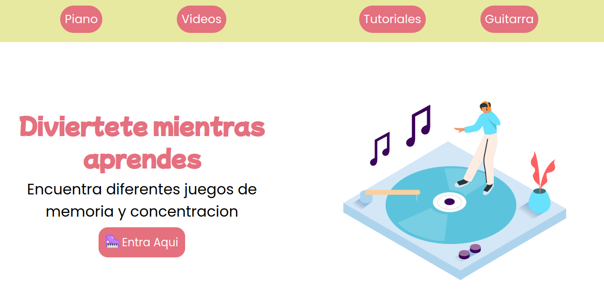
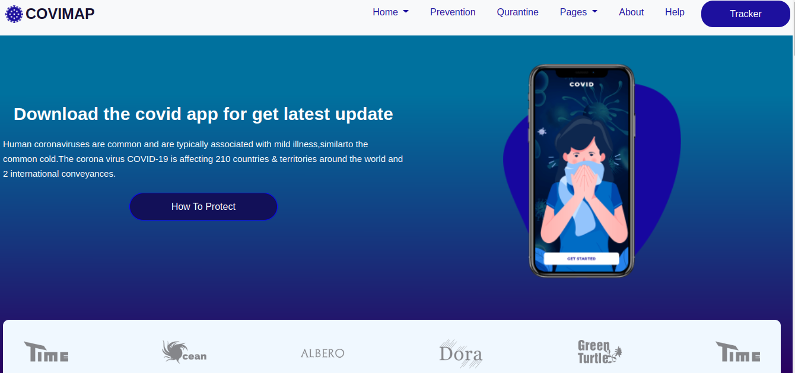
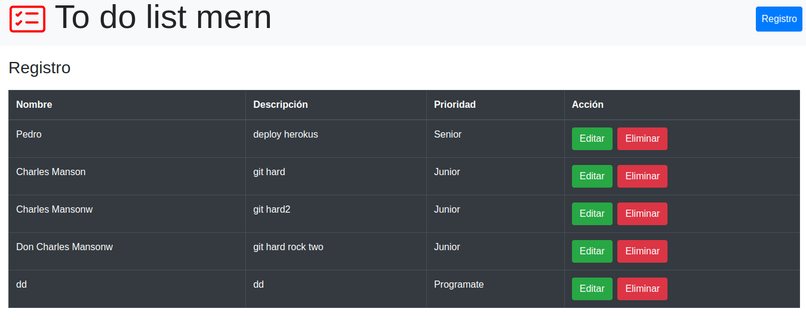
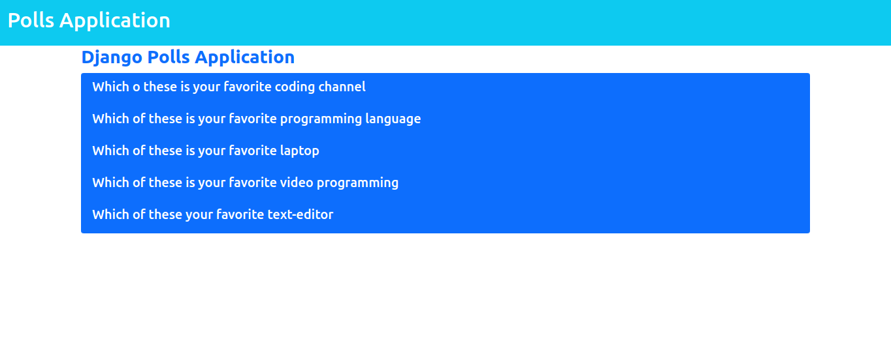
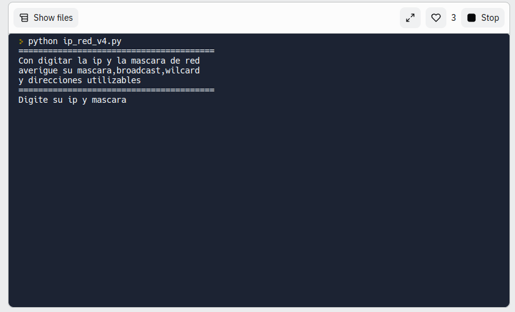
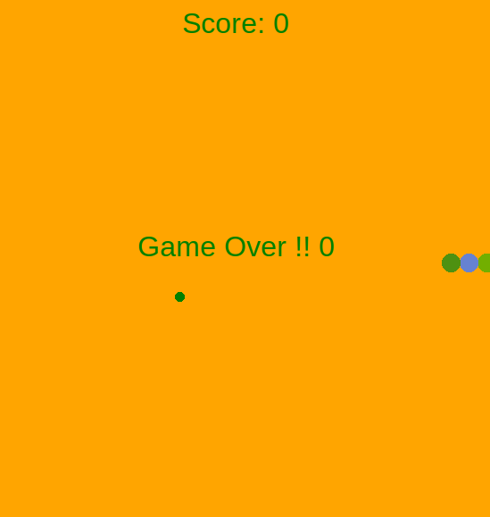

<!--
**dariohimo/dariohimo** is a ✨ _special_ ✨ repository because its `README.md` (this file) appears on your GitHub profile.

Here are some ideas to get you started:

- 🔭 I’m currently working on ...
- 🌱 I’m currently learning ...
- 👯 I’m looking to collaborate on ...
- 🤔 I’m looking for help with ...
- 💬 Ask me about ...
- 📫 How to reach me: ...
- 😄 Pronouns: ...
- ⚡ Fun fact: ...
- example icon 
- https://jsrepos.com/lib/showcase-your-skills-on-your-github-readme-or-resum-with-ease

-->
---
---
### Hi there 👋
---
---

  

---
## PROJECT SCREENSHOTS Bootcam Programate.

  

___
---

___

## Toquen el DOM 
___

___
## Impacto covid19
___

___

##  toDoList
___

___

## systemPolls
___

___

## My project on python
___

## ipv4_network

___

## Snake turtle python
___

___

## THE STACKS I KNOW

 **CSS** 
___

 **JAVASCRIPT**
___

 **HTML**

___

 **PYTHON**
___

 **BOOTSTRAP**
___
 **DJANGO**
___

 **MARKDOWN**
___

